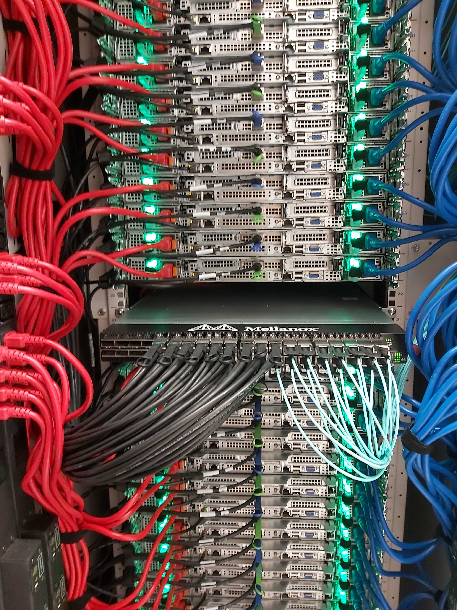

# What's an HPC cluster?

HPC stands for High Performance Computing. Back in the day, "supercomputers" were monolithic standalone machines
with specialized hardware–very different from what you would find in
home and office computers.  Nowadays, the majority of supercomputers
are instead **computer clusters** (or just "clusters" for short) ---
collections of (comparatively) low-cost standalone computers that are
networked together and endowed with software to coordinate programs on
(or across) those computers.

The computational systems made available by Princeton Research
Computing are, for the most part, *clusters*.  Each computer in the
cluster is called a **node**, and we commonly talk about two types of nodes: head-nodes and compute-nodes.

<figure>
  
  <figcaption>Racks of computers in a data center.</figcaption>
</figure>

 

<figure>
  
  <figcaption>Backend of computer racks.</figcaption>
</figure>

## Terminology

* **Head-Node** - The head-node is the computer where we land when we ssh to log in to the cluster. This is where we edit scripts, compile code, and submit jobs to the scheduler. The head-nodes are shared with other users and jobs should not be run on the head-nodes themselves.
* **Compute-Node** - The compute-nodes are the computers where jobs should be run. In order to run jobs on the compute-nodes we must go through the job scheduler. By submitting jobs to the job scheduler, the jobs will automatically be run on the compute-nodes once the requested resources are available. The Princeton clusters use SLURM as their scheduling program and we will get back to this in a later section.
* **Cores** - A shorthand way to refer to the number of processor cores (usually physical) of a CPU in a node.

**IMPORTANT**: *You may run test jobs on the head nodes that run for up to 10 minutes and use up to 10% of the CPU cores and memory. You will likely disrupt the work of others if you exceed these limits.*

## How Do Princeton's HPC Clusters Work?

To have your program run on the clusters, you can start a **job** by submitting the following files on the head-node:
1. your code that runs your program
2. a separate script–known as a SLURM script–that asks for the amount of resources you'll need in terms of the amount memory, the number of cores, number of nodes, etc. you'll need. As mentioned previously, Princeton uses a scheduler called **SLURM**, which is why this script is referred to as your SLURM script.

Once your files are submitted, the **scheduler** takes care of figuring out when the resources you requested will become available on the compute-nodes. Once resources become available, the scheduler runs your program on the compute-nodes. 

### No Internet Access on the Compute Nodes

For security reasons the compute nodes do not have internet access. This means that when you submit your job (your program + your slurm script) to be run on the cluster, those jobs cannot involve any steps that require an internet connection to work. For example, downloading data from a site, scraping websites, downloading packages, etc., will not work on the compute-nodes.

**NB:** You need to make sure all needed files are present on the cluster before submitting the job to the scheduler.
