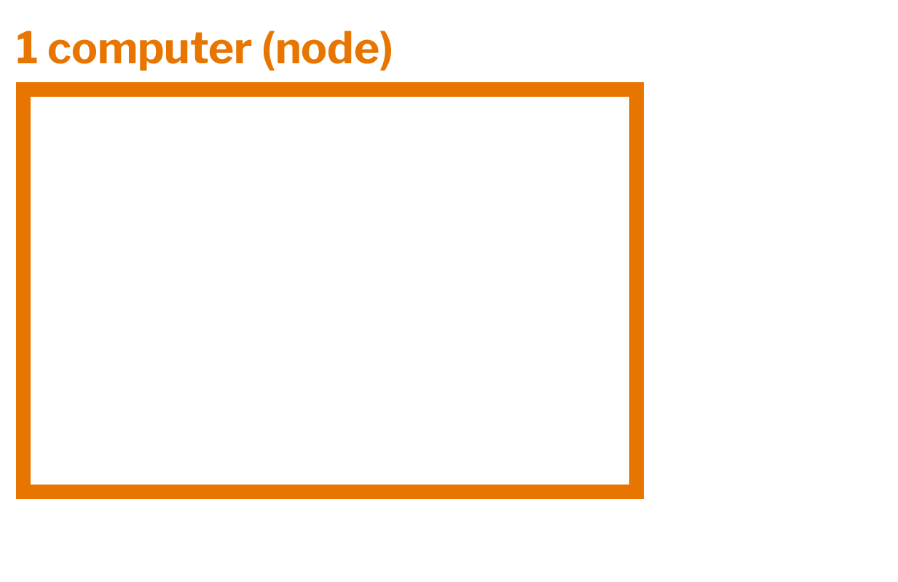
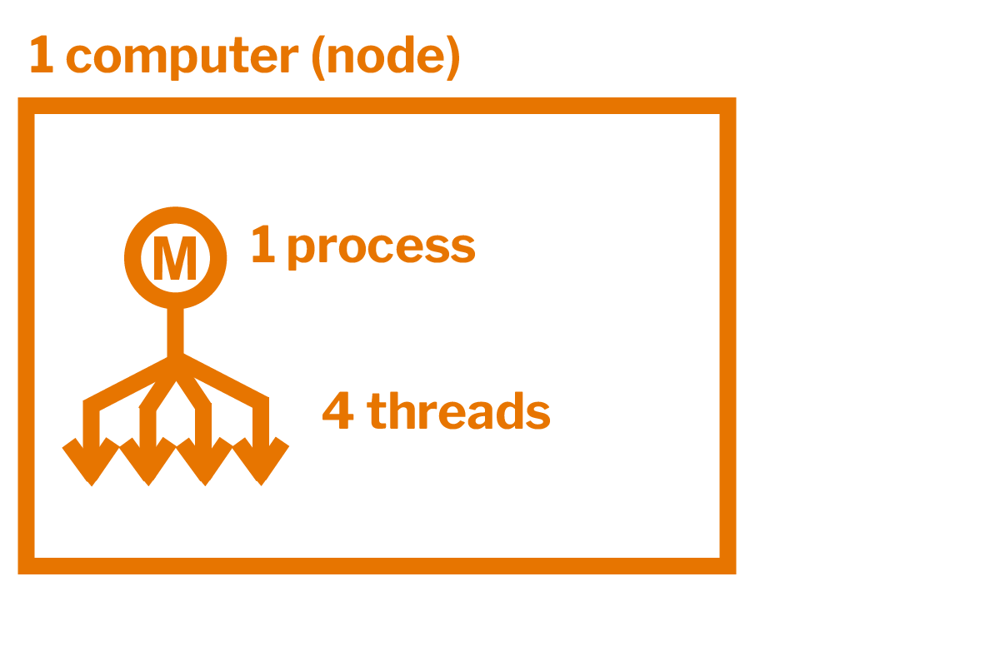
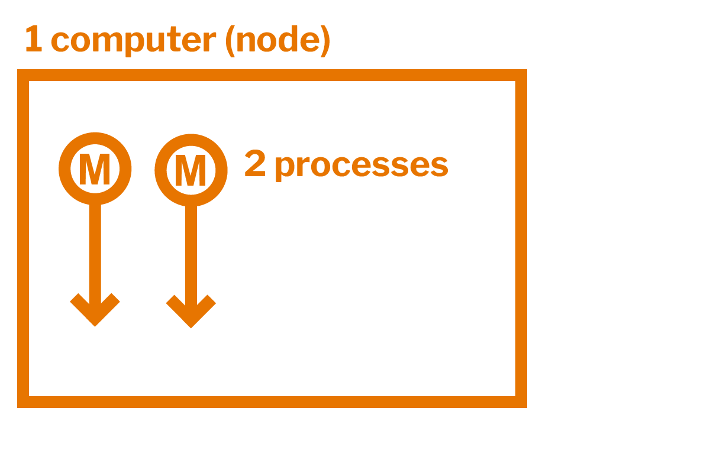
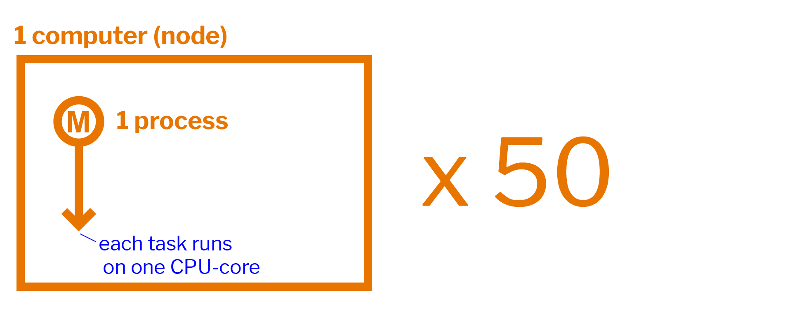
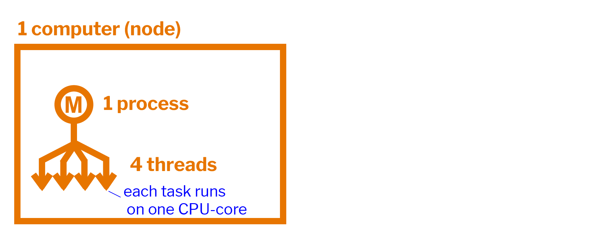
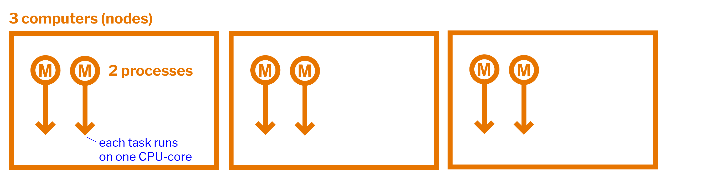

# Parallel Programming Primer

A common misconception is that simply running your code on a cluster will result in your code running faster.

**Clusters do not run code faster by magic - often need parallelization that is explicitly set by the programmer.**

In other words, the burden of modifying code to take advantage of multiple cores or nodes is on you as the programmer.

Although learning *how* to parallelize code is outside the scope of this workshop, for our purposes it is useful to at least be familiar with the typical ways in which code can be parallelized.

This guide is intended as a very basic introduction to parallel programming concepts, with some notes on relevant [SLURM](https://researchcomputing.princeton.edu/support/knowledge-base/slurm) script parameters, which will be more useful after covering the slurm section of this workshop.

After a brief introduction to the computer parts and terms relevant for parallel computing, we provide an overview of four common methods of parallelism. Although this guide does not teach *how* to implement each type of parallelsim in your code, it does point to relevant resources for learning.

For a more comprehensive introduction to parallel programming concepts, check [Research Computing's workshop schedule](https://researchcomputing.princeton.edu/learn/workshops-live-training) for the next *Primer on Parallel Programming* workshop, or view [materials and recordings from past workshops](https://researchcomputing.princeton.edu/learn/workshops-live-training/archives-past-workshops).

## Serial versus Parallel Programming

### Serial Programming

Serial programming is the default way of running code. It involves running each section of code sequentially, and only one piece of code can be processed at a time.

### Parallel Programming

Parallel programming involves breaking up code into pieces that can run simultaneously.

*Images sourced from Lawrence Livermore National Laboratory's Introduction to [Parallel Computing Tutorial](https://hpc.llnl.gov/training/tutorials/introduction-parallel-computing-tutorial).*

## Brief Introduction to Relevant Vocabulary

### Computer Hardware (CPUs, GPUs, and Memory)

**CPU-chip** – The computer's main processing unit. You can think of this as the 'brain' of the computer. This is the piece of hardware that performs calculations, moves data around, has access to the memory, etc. In systems such as [Princeton's High Performance Computing clusters](https://researchcomputing.princeton.edu/systems/systems-overview), CPU-chips are made of multiple CPU-cores.

**CPU-core** – A microprocessing unit on a CPU-chip. Each CPU-core can execute an independent set of instructions from the computer.

**GPU** – Stands for the Graphics Processing Unit. Originally intended to process graphics, in the context of parallel programming this unit can do a large number of simple arithmetic computations.

**Memory** – In this guide memory refers to Random-Access Memory, or RAM. The RAM unit stores the data that the CPU is actively working on.

### Additional Parallelism Terminology

An understanding of **threads** and **processes** is also useful when discussing parallel programming concepts.

If you consider the code you need to run as one big job, to run that code in parallel you'll want to divide that one big job into several, smaller *tasks*^[Although confusing at times, in SLURM scripts, the word tasks generally refers to processes.]. This is the general idea behind parallel programming.

When tasks are run as **threads**, the tasks all share direct access to a common region of memory. The mulitple threads are considered to belong to one process.

When tasks run as distinct **processes**, each get their own siloed memory to run within–even if run on the same computer.

To put it even more simply, processes have their own memory, while threads belong to a process and share memory.

<!--- Current attempt for images & captions. Works, but a hack. Probably not consdiered accessible. --->
||||
|----|----|----|
|If a box represents a computer,|and a task can be represented as line stemming from a spot in memory, then tasks run as threads can be represented as the above, where all threads have access to the same memory space,|and tasks run as processes can be represented as the above, where each process has its own siloed memory.|

<!--- Initial attempt for images & captions. Gives a weird spacing that makes one image's caption look like it belong to another image. --->
<!--- 
<figure>
  
  <figcaption>If a box represents a computer,</figcaption>
</figure>

 

<figure>
  
  <figcaption>and a task can be represented as line stemming from a spot in memory, then tasks run as threads can be represented as the above, where all threads have access to the same memory space,</figcaption>
</figure>

 

<figure>
  
  <figcaption>and tasks run as processes can be represented as the above, where each process has its own siloed memory.</figcaption>
</figure>
--->

## Four Basic Types of Parallel Programming

The diagrams used in the following sections can be read according to the following key diagram.The gray text indicates the corresponding SLURM script parameters for what's shown in the diagram (this will be more useful later, once the SLURM section is covered).

<figure>
  
</figure>

### 1. Embarassingly Parallel

This is the simplest type of parallelism to implement.

A project is embarassingly parallel if each task in a job can be run completely independently of other tasks. In other words, the program runs a bunch of copies of the same thing, but each copy has different input parameters.

In embarassingly parallel programs, there is no communication required between tasks, which is what makes it easy to implement.

#### Example SLURM Script  
`--nodes = 1          # node count`  
`--ntasks = 1         # total number of tasks across all nodes`  
`--cpus-per-task = 1  # cpu-cores per task`  
`--array = 0-49       # number of times you'd like your task to run, each time with different input`  

#### Example Diagram   
<figure>
  
</figure>

#### Example Code

  
 Click to expand 

Let's say your project consists of the following data, with one million x-values:

`x = 1, 2, 3, 4, ..., 1000000`

You've written the following program to calculate and print a y-value for each x-value.

`y = (x * 0.3) + 4.21`
`print(y)`

Here, a task  is the calcuation of the y-value for one x-value.

Normally, you would run your program serially, meaning you'd use only 1 core to run your program for all the x-values in your data. That one core can only run one task at a time. If, for the sake of simplicity, we say each task takes 1 second to complete, then the program should take 1,000,000 tasks x 1 second/task = 1,000,000 seconds to complete.

If you run the program in parallel, however, you can now use multiple cores on one computer simultaneously. If, for example, you could have access to 50 cores, then each core can work on a different value of x at the same time. This will cut down the time it takes to complete all tasks to 1,000,000 tasks x 1 second/task % 50 cores = 20,000 seconds.

  

 
On Princeton's Research Computing clusters, you can run embarassingly parallel programs as [job arrays](https://researchcomputing.princeton.edu/support/knowledge-base/slurm#arrays).

### 2. Shared-Memory Parallelism (Multithreading)

Shared-memory parallelism is when tasks can be run as **threads** on separate CPU-cores of the same computer. In other words, a single program can access many cores on one machine.

As the name implies, because the CPU-cores are on the same computer they all have access to the same memory card, and therefore share memory.

Due to the shared memory, a light level of communication is required between the cores working on each task.

Since multiple threads are used to complete a job, shared-memory parallelism is often also refered to as **multithreading**.

A common programming model for shared-memory parallelism is called fork/join. The program starts out with a 'unified' parent thread, and forks into multiple child threads, which then join together again at the end of the program in order to share results with each other.  

#### Methods Associated with Shared-Memory Parallelism

The most common method to implement shared-memory parallelism is **OpenMP**, but there's also POSIX Threads (pthread), SIMD or vector intrinsics (Intel MKL), C++ Parallel STL (Intel TBB), and shmem.

#### Example SLURM Script  
`--nodes = 1          # node count`  
`--ntasks = 1         # total number of tasks across all nodes`  
`--cpus-per-task = 4  # cpu-cores per task (>1 if multi-threaded tasks)  
`
#### Example Diagram  
<figure>
  
</figure>

#### Example Code
Try running this [OpenMP example](https://github.com/PrincetonUniversity/hpc_beginning_workshop/tree/master/RC_example_jobs/fortran/multithreaded) from our *Getting Started with the Research Computing Clusters* workshop.

### 3. Distributed-Memory Parallelism (Multiprocessing)

Distributed-memory parallelism generally refers to running tasks as multiple **processes** that do not share the same space in memory. While this can technically happen on one computer, that is a more complicated use case, and the more intuitive way to understand it is when tasks are run on different computers, as those more obviously each have their own memory.

As a quick example, distributed-memory parallelsim could be used if your program needed to work on a large matrix of data. The matrix could be divided up into 20 pieces, where each core worked on one of the 20 pieces, but at some point they'd need to communicate with each other and coordinate.

This is one of the more complicated types of parallelism, since it requires a high level of communication between different tasks to ensure that everything runs properly.

Since multiple processes are needed to complete a job, distributed-memory parallelism is often referred to as **multiprocessing**.

#### Methods Associated with Distributed-Memory Parallelism

The most common method to implement distrubted-memory parallelism is **MPI**.

For those working with machine learning, you may also consider Spark/Hadoop, Dask, and General Multiprocessing.

#### Example SLURM Script  
`--nodes = 3            # node count`  
`--ntasks = 2           # total number of tasks across all nodes`  
`--cpus-per-task = 1    # cpu-cores per task (>1 if multi-threaded tasks)`  

#### Example Diagram  
<figure>
  
</figure>

#### Example Code
Try running this [MPI example](https://github.com/PrincetonUniversity/hpc_beginning_workshop/tree/master/RC_example_jobs/cxx/parallel) from our *Getting Started with the Research Computing Clusters* workshop.

### 4. Accelerator Parallelism (GPU's, and FPGA's)

Accelerator Parallelism uses different types of computer hardware, such as GPU's and FPGA's, to simply do computations faster than any CPU chip is able to.

To learn more about GPU's, see the [01_what_is_a_gpu](https://github.com/PrincetonUniversity/gpu_programming_intro/tree/master/01_what_is_a_gpu) repository in Research Computing's [*Introduction to GPU Programming* workshop](https://github.com/PrincetonUniversity/gpu_programming_intro).

To learn more about FPGA's, view the recording of [Intel's workshop on FPGA's](https://researchcomputing.princeton.edu/learn/workshops-live-training/archives-past-workshops/spring-2021-workshop-materials) from Spring 2021. (Search for 'FPGA' on the page.)

#### Example Code
Try running several [GPU examples](https://github.com/PrincetonUniversity/gpu_programming_intro/tree/master/03_your_first_gpu_job) from Research Computing's *Introduction to GPU Programming* workshop.

## In Summary

To summarize, the burden of modifying the code to take advantage of multiple cores or multiple nodes is on the programmer. There are multiple types of parallelism to choose from, but just running code on a ‘bigger’ computer doesn’t make it run faster.

## Resource Links to Dive Deeper into Parallel Programming Topics

Resource lists by topic, compiled by staff in Princeton's Research Computing and PICSciE groups:

* [Overview of HPC & Parallel Programming](https://researchcomputing.princeton.edu/education/external-online-resources/hpc-overview)
* [MPI](https://researchcomputing.princeton.edu/education/external-online-resources/mpi)
* [OpenMP](https://researchcomputing.princeton.edu/education/external-online-resources/openmp)

Check Research Computing's upcoming [workshop schedule](https://researchcomputing.princeton.edu/learn/workshops-live-training) for deeper training on Parallel Programming topics. (Workshops are on parallel computing are typically held in the Fall semester).

## Online Resources Used to Write This Guide

[A Primer on Parallel Programming](https://princetonuniversity.github.io/PUbootcamp_winter2021/sessions/M2C-parallel-programming/), by Garrett Wright

[University of Oklahoma's Supercomputing in Plain English Workshop Series](http://www.oscer.ou.edu/education.php), by Henry Neeman

[Material for Princeton's R in HPC Workshop](https://github.com/PrincetonUniversity/HPC_R_Workshop), by Ben Hicks

[Parallel Programming Primer I: Fundamental Concepts](https://medium.com/craftdata-labs/parallel-programming-for-data-processing-fundamental-concepts-ab17a3b3d6a9), and [Parallel Programming Primer II: Multiprocessing and Multithreading](https://medium.com/craftdata-labs/parallel-programming-for-data-processing-part-ii-multiprocessing-and-multithreading-8ec8649e9dd1) by Saurav Dhungana
