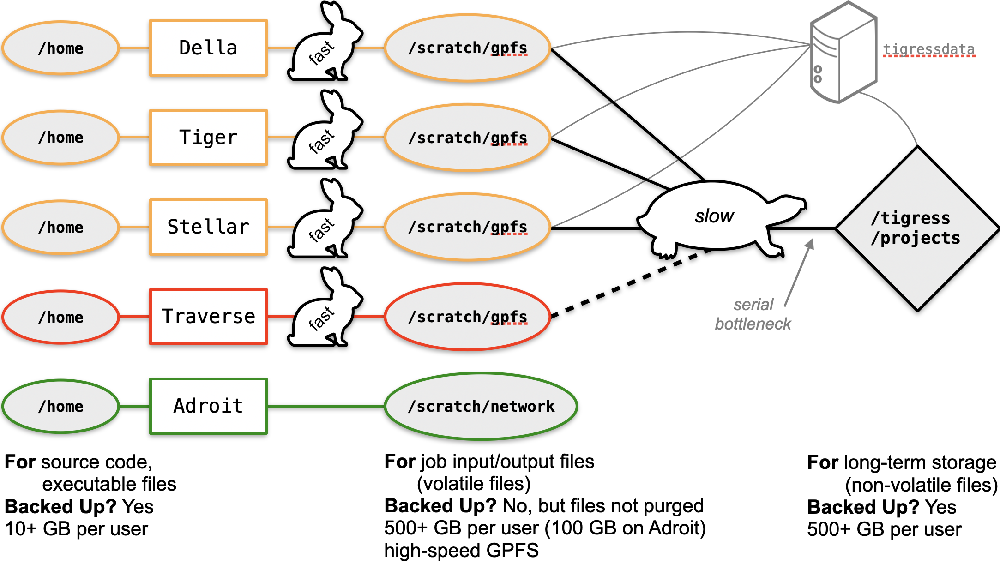

# Working with Files on the Clusters

## The Filesystems

The main file systems on Princeton's Research Computing clusters are:

+ `/home/<YourNetID>`: where you should place source code and executables
+ `/scratch/gpfs/<YourNetID>` (or `/scratch/network/<YourNetID>` on Adroit): where you should place job output and intermediate results
+ `/tigress/<YourNetID>`: for final results for the long term
+ `/projects/<Research Group Name>`: for group work

*IMPORTANT*: Tigress is for non-volatile files only. Do not make the mistake of writing your job output here. Users are tempted to do this because `/tigress` is backed-up while `/scratch/gpfs` is not. However, this is a mistake and you may adversely affect other users by writing or reading job files from `/tigress` during your production runs.



Note that `/tigress` and `/projects` are file systems. You cannot `ssh` to either of them. When you `ssh` to a cluster, you land in `/home`.

### Where Should I Put My Files?

* **Code** -- somewhere under your home-directory tree is ok (if these are smaller files that aren't too huge)
* **Temporary files your code generates while it runs** -- depends whether you want to handle the housekeeping of removing these files yourself or delegate the housekeeping to SLURM:
    + If your script removes temporary files -- save them to `/scratch` (this is a scratch area local to each cluster; not auto-purged, so send "workspace" files here if your script handles deleting them)
    + If you want SLURM to remove temporary files -- save them to `/tmp` (this is an alias for the same physical disk area as `/scratch`, but if you save to `/tmp`, SLURM will automatically remove anything that got written here when your SLURM job ends)
* **Output files after code runs** -- `/scratch/gpfs` (or, on Adroit, `/scratch/network`); these folders are *fast access*.  Not backed up, but also not purged (you should do this yourself -- more on this later). Each `/scratch` space is *per cluster*, so you aren't competing with I/O requests across the entire set of Princeton resources.
* **Longer term results for archiving** -- move it to `/tigress` or, if possible, to `/projects` (preferred).  These *are* backed up

**WARNING: Why you shouldn't put your on-the-fly code output files on `/tigress` or `/projects` -- the curse of continual backup**

Additional information using the file system can be found in Research Computing's [Data Storage KnowledgeBase article](https://researchcomputing.princeton.edu/support/knowledge-base/data-storage).

The commands below give you an idea of how to properly run a job in terms of suitable locations for file output:

```
$ ssh <YourNetID>@della.princeton.edu  # or adroit
$ cd /scratch/gpfs/<YourNetID>  # on Adroit use /scratch/network/<YourNetID>
$ mkdir myjob
$ cd myjob
# put necessary files and Slurm script in myjob
$ sbatch job.slurm
```

If the run produces data that you want to backup, then you must copy or move the data to `/tigress` after the run:
```
$ cp -r /scratch/gpfs/<YourNetID>/myjob /tigress/<YourNetID>
```

## How Do I Get My Files Onto (or Off) the Cluster?

One of the most frequently asked questions is how to get files to Adroit or any other cluster.
Again, Linux/MacOS has an answer out of the box: the `scp` command. For Windows, clients like PuTTY and Mobaxterm
or FTP clients (like [WS_FTP](https://www.ipswitch.com/secure-information-and-file-transfer/wsftp-client)–paid, sadly–or [Filezilla](https://filezilla-project.org/)) are needed. In both cases,
make sure you're using interactive logon. Filezilla especially can be a pain
with Duo Authentication for Nobel, but we have some tips [here](https://askrc.princeton.edu/question/343/how-do-i-get-filezilla-to-work-around-duo/).

If you're transferring a lot of files, consider
zipping them.

The default client to transfer files is `scp`. This is a copy command that uses
SSH to copy files.

The general structure of the scp command is:  
`scp [options] [netid]@source-host:file/location [netid@]destination-host:file/location`

It's generally more straightforward to transfer files from your personal computer to the clusters, since you don't need to specify the user and host for the system you're already in.

### Example - Using scp Command

A Princeton student with the netid jessedoe wants to transfer a `data.csv` file from their personal laptop to the `/scratch/network/jessedoe` folder on the Adroit cluster. To do this, they would use the following command:

`scp ~/mydatafiles/data.csv jessedoe@adroit:/scratch/network/jessedoe`

Transferring a folder requires the -r option, and would therefore look like this:

`scp -r ~/mydatafiles jessedoe@adroit:/scratch/network/jessedoe`  

If you need to transfer particularly large files, you may need to use Globus. We have [additional information on Globus on our website](https://researchcomputing.princeton.edu/services/globus_description), and run a regular workshop on data transfers with Globus.

### Learn More About File Transfer Options

Additional information on learning how to transfer data–with tools such as scp, ftp, rsync, and Globus–can be found on Research Computing's [Learning Resources: Data Transfer](https://researchcomputing.princeton.edu/education/external-online-resources/data-transfer) page.

## SSH Keys: `scp` without typing passwords

Typing passwords every time you want to connect to a machine or, more annoying, every time you want to copy a file to/from a remote machine gets annoying quickly.  One solution is to enable passwordless login/remote operations by generating a public/private pair of *ssh keys* and using them to negotiate the connection.  The procedure is explained in [this guide](https://github.com/PrincetonUniversity/removing_tedium/tree/master/02_passwordless_logins).
