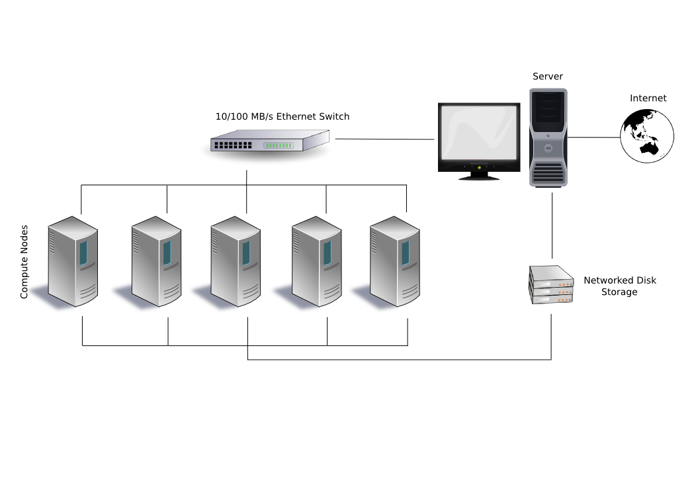

# What's an HPC cluster?


[*By Mukarramahmad (Own work) [Public domain], via Wikimedia Commons*](https://commons.wikimedia.org/wiki/File:Beowulf.png)

## Terminology

* Head Node
```
  The server that connects a cluster to the an outside network.
```
* Compute Node
```
  A server that is used for running computations, sometimes managed by a scheduler.
```
* Cores
```
  A shorthand way to refer to the number of
  processor cores (usually physical) of a CPU
  in a node. 
```
